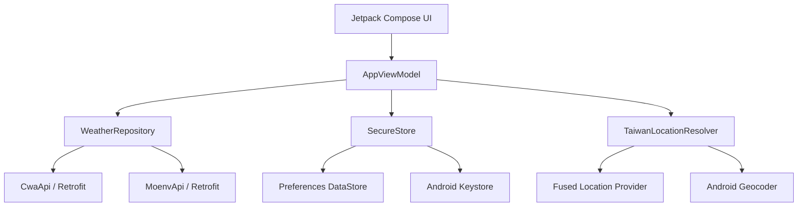
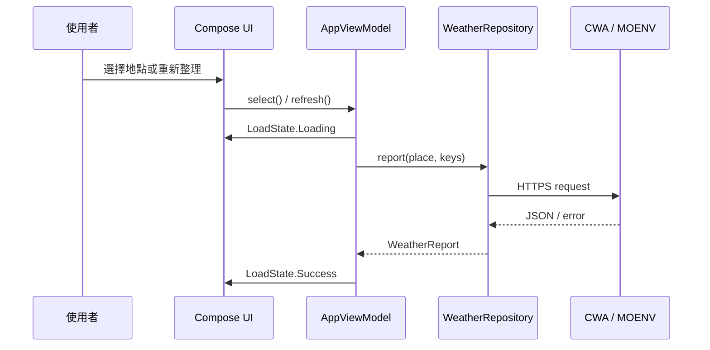

# 系統架構

## 架構目標

- UI 與遠端 JSON 解析分離。
- API Key 不寫入程式碼或 Log。
- CWA 與 MOENV 可以獨立失敗，不讓空品服務影響主要天氣。
- 以單一 Android App 模組維持簡單、易維護的結構。

## 高階架構



## 目錄結構

```text
app/src/main/
├── AndroidManifest.xml
├── java/tw/app/taiwanweather/
│   ├── MainActivity.kt
│   ├── AppViewModel.kt
│   ├── data/
│   │   ├── Models.kt
│   │   ├── SecureStore.kt
│   │   ├── WeatherApi.kt
│   │   └── WeatherRepository.kt
│   ├── location/
│   │   └── TaiwanLocationResolver.kt
│   └── ui/
│       ├── AppScreen.kt
│       └── Theme.kt
└── res/
    ├── drawable/
    ├── mipmap-anydpi*/
    └── values/
```

## 元件責任

### MainActivity

- 建立 Compose 內容。
- 提供 `AppViewModel`。
- 處理定位權限請求。
- 根據顯示模式更新狀態列及 Navigation Bar。

### AppViewModel

- 保存單一 `AppUiState`。
- 協調天氣讀取、位置解析、收藏與設定。
- 將 Repository 例外轉為 UI 狀態。
- 使用 `StateFlow` 對 Compose 發布狀態。

### WeatherRepository

- 查詢並解析 CWA、MOENV 回應。
- 合併即時觀測與預報資料。
- 提供 API Key 連線測試。
- 將 API 模型轉換為 APP 內部模型。

### SecureStore

- 使用 Preferences DataStore 保存收藏、目前地點及顯示模式。
- 使用 Android Keystore 建立不可匯出的 AES 金鑰。
- 使用 AES-GCM 加密兩組 API Key 後再存入 DataStore。

### TaiwanLocationResolver

- 取得 Fused Location Provider 最近位置。
- 使用 Geocoder 解析國碼、縣市及鄉鎮。
- 只接受台灣行政區白名單。

### Compose UI

- 顯示主畫面、地點收藏、縣市選擇、鄉鎮選擇與設定。
- 不直接發送網路請求。
- 使用 `MaterialTheme` 支援明暗模式。

## 狀態資料流



## 錯誤隔離

- CWA 預報失敗：整體報告顯示錯誤。
- CWA 即時觀測失敗：保留預報資料。
- MOENV 失敗：不顯示空品區塊，天氣仍可使用。
- Geocoder 失敗：提示使用者並保留手動選擇功能。
