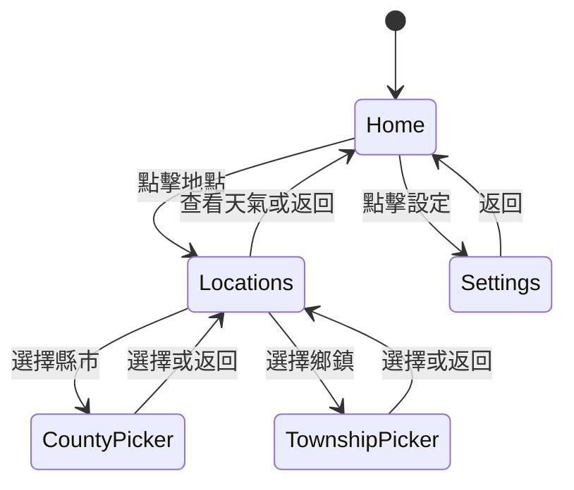

# 系統設計文件

## 1. 需求範圍

### 功能需求

- FR-01：使用者可輸入及測試 CWA API Key。
- FR-02：使用者可輸入及測試 MOENV API Key。
- FR-03：系統只允許查詢台灣縣市與鄉鎮。
- FR-04：使用者可透過 GPS 取得所在地點。
- FR-05：使用者可手動搜尋縣市及鄉鎮。
- FR-06：系統顯示目前天氣與未來七日預報。
- FR-07：系統顯示空氣品質資訊。
- FR-08：使用者可收藏、刪除及排序地點。
- FR-09：系統依目前地點的日出日落時間自動切換淺色及深色模式。
- FR-10：系統顯示目前地點當日日出及日落時間。

### 非功能需求

- NFR-01：API Key 不得硬編碼於 APP。
- NFR-02：所有 API 流量使用 HTTPS。
- NFR-03：定位權限被拒絕時，手動選擇仍可使用。
- NFR-04：空品服務失敗不得阻斷天氣功能。
- NFR-05：畫面支援 Android 字體縮放及淺／深色對比。
- NFR-06：支援 Android 8.0 以上版本。

## 2. 使用案例

### UC-01 設定授權碼

前置條件：裝置可連上網路。

主要流程：

1. 使用者進入設定。
2. 點擊官方申請連結取得授權碼。
3. 輸入授權碼。
4. 執行連線測試。
5. 系統顯示「可用」。
6. 使用者儲存設定。

例外流程：空白、無效、過期、額度超限、無網路或服務錯誤會顯示對應訊息。

### UC-02 手動查看天氣

1. 使用者進入地點與收藏。
2. 搜尋並選擇縣市。
3. 搜尋並選擇鄉鎮。
4. 按查看天氣。
5. 系統查詢 CWA，並在 MOENV Key 存在時查詢空品。
6. 系統顯示報告。

### UC-03 GPS 查看天氣

1. 使用者按定位圖示。
2. 系統要求定位權限。
3. 系統取得位置並解析行政區。
4. 若在台灣支援清單內，查詢並顯示天氣。
5. 若不支援，顯示「目前不支援此地點天氣」。

## 3. 導覽設計



## 4. 資料設計

### DataStore

| Key | 內容 | 保護方式 |
| --- | --- | --- |
| `cwa_api_key` | CWA Key | AES-GCM 密文 |
| `moenv_api_key` | MOENV Key | AES-GCM 密文 |
| `favorites` | 收藏地點序列 | APP 私有 DataStore |
| `selected` | 目前地點 | APP 私有 DataStore |

收藏格式目前使用：

```text
縣市::鄉鎮|縣市::鄉鎮
```

行政區名稱不包含分隔符號，因此可安全解析。若未來資料結構增加欄位，應遷移為 JSON 或 Room。

## 5. 錯誤設計

| 狀況 | 使用者訊息／行為 |
| --- | --- |
| API Key 空白 | 引導至設定頁 |
| 401/403 | 授權碼無效或已過期 |
| 429 | API 使用次數已達上限 |
| DNS 失敗 | 目前無法連上網路 |
| Timeout | 連線逾時 |
| CWA 欄位缺失 | 顯示 `--` 或使用預報值 |
| MOENV 失敗 | 隱藏空品，不中斷天氣 |
| 境外 GPS | 不支援此地點天氣 |

## 6. 安全與隱私

- 最小權限：不要求背景定位。
- 金鑰加密：Keystore + AES-GCM。
- 傳輸安全：禁止 Cleartext Traffic。
- 無自有後端：降低集中式資料外洩面。
- 顯示控制：API Key 預設遮蔽，使用者可暫時顯示。

## 7. 可用性設計

- 長行政區清單使用全頁搜尋，不使用過長 Dropdown。
- 收藏排序按鈕保留明確的內容描述。
- 系統返回鍵遵循畫面階層。
- 日出後使用淺色模式，日落後使用深色模式，系統列同步切換。
- 載入、成功、錯誤都有明確狀態。

## 8. 後續擴充

- 依 GPS 距離選擇最近空品測站。
- 使用 Room 建立天氣快取與離線瀏覽。
- 加入官方警特報與通知。
- 加入 Compose UI 測試及 MockWebServer API 測試。
- 改用行政區邊界 GeoJSON 提高離島及邊界定位準確度。
